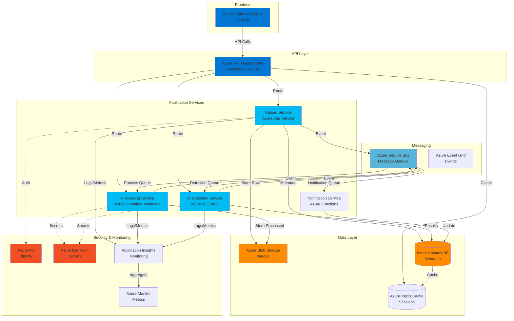
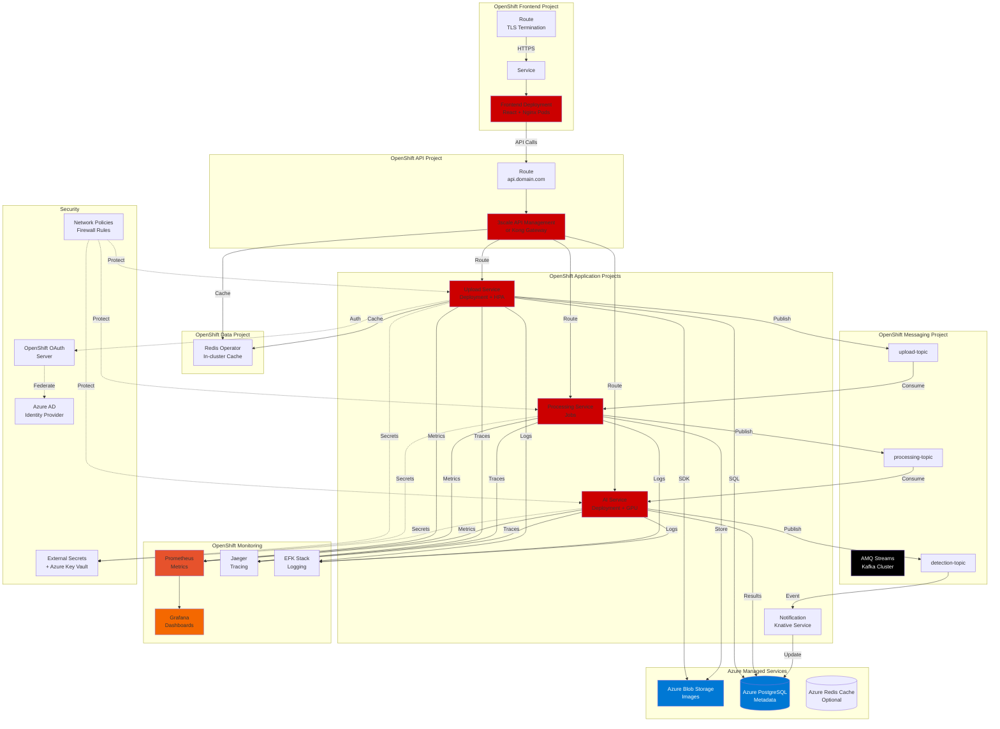
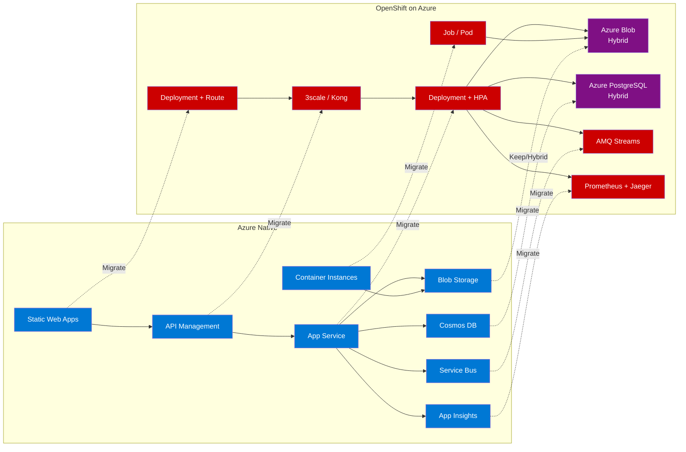
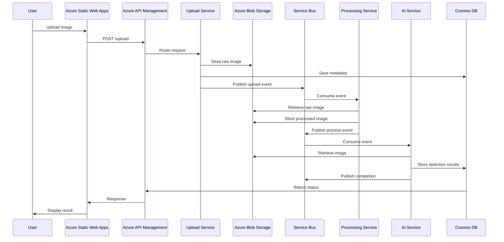
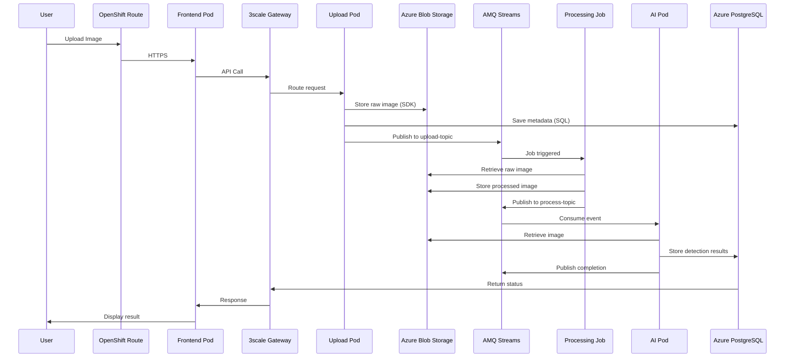
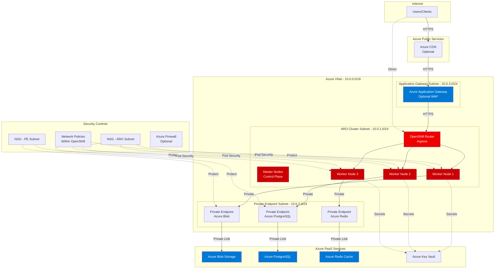
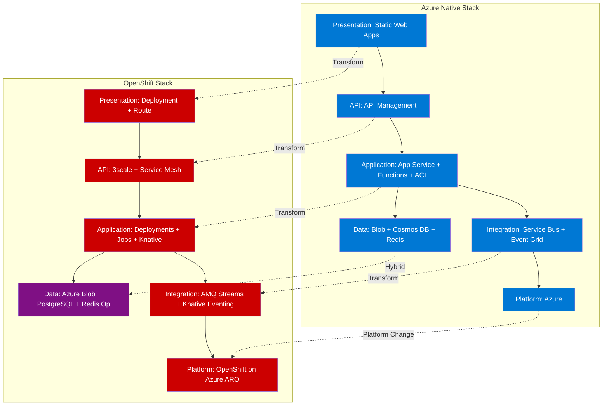

# Architecture Diagrams

This document contains visual diagrams for both architectures using Mermaid.

## Azure Native Architecture Diagram

## OpenShift on Azure Architecture Diagram

## Simplified Comparison Diagram

## Data Flow Comparison

### Azure Native Data Flow

### OpenShift on Azure Data Flow

## Network Architecture - OpenShift on Azure

## Technology Stack Layers

## Notes

- **Blue**: Azure-native services
- **Red**: OpenShift-native components
- **Purple**: Hybrid (Azure services used from OpenShift)
- **Arrows**: Data/control flow
- **Dotted lines**: Security/authentication relationships

These diagrams provide a visual representation of:
1. The complete architecture for both platforms
2. Component relationships and data flow
3. Network topology for OpenShift on Azure
4. Migration path from Azure to OpenShift
5. Technology stack layering

The diagrams can be rendered in any Markdown viewer that supports Mermaid, including GitHub, GitLab, and various documentation platforms.
